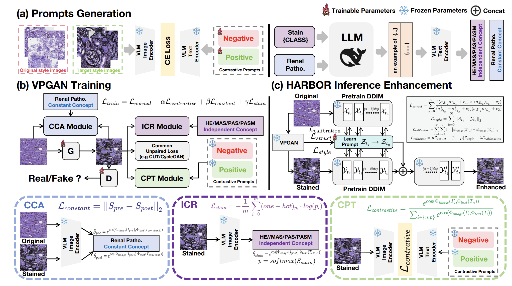

# VLM-based Prompts as the Optimal Assistant for Unpaired Histopathology Virtual Staining (ACMMM 2025)
The PyTorch implementation of VLM-based Prompts Generative Adversarial Network (VPGAN) and Histopathology stAining expeRt Based variOus pRompts (HARBOR), as described in the paper "VLM-based Prompts as the Optimal Assistant for Unpaired Histopathology Virtual Staining." [ACM-DL]((https://dl.acm.org/doi/abs/10.1145/3746027.3755105))



## Installation Guide for Linux (using anaconda)
### Pre-requisities: 
- Linux (Tested on Ubuntu 22.04)
- NVIDIA GPU H100*8 with CUDA 11.8 and cuDNN 8.6
- Python(3.10.0), numpy(1.24.4), pandas(2.2.3), torch(2.0.1), mpi4py(3.1.4)，openai-clip(1.0.1)

## Prepare your data
### ANHIR
1. Download kidney WSIs from [ANHIR](https://anhir.grand-challenge.org/)
2. Use the method in [UMDST](https://ojs.aaai.org/index.php/AAAI/article/view/20054) to divide the WSI into training set and test set and convert it into 256×256 patches.

The final structure of datasets should be as following:
```bash
DATA_ROOT_DIR/
    └──train/    
        └──dataset1/
          ├── 1.png
          ├── 2.png
          └── ...
        └──dataset2/
          ├── 1.png
          ├── 2.png
          └── ...
        └──...
    └──val/    
        └──dataset1/
          ├── 1.png
          ├── 2.png
          └── ...
        └──dataset2/
          ├── 1.png
          ├── 2.png
          └── ...
        └──...
```
dataset include H&E,MAS,PAS,PASM

### VLM weight
You can obtain the model weights from relevant VLM works, such as [CONCH](https://github.com/mahmoodlab/CONCH).

## Running Experiments
### Prompt generation

#### Contrastive Prompt
Referring to the binary classification initialization code in [CLIP-LIT](https://github.com/ZhexinLiang/CLIP-LIT), and replacing CLIP with [CONCH](https://github.com/mahmoodlab/CONCH) to obtain the prompts.

#### Concept anchor
Given the rapid progress of large language models (LLMs), we recommend using the latest models such as Gemini 3 Pro and GPT-5.1. They show significant improvements in pathology.

### VPGAN train
You need to place all the `.pt` files of text prompts embeddings generated previously in the subfolder `text` of the `VPGAN` folder in the following style.
```bash
VPGAN/
    └──text/    
        └──concept/
          ├── he_concepts.pt
          ├── mas_concepts.pt
          ├── pas_concepts.pt
          ├── pasm_concepts.pt
          └── same_concepts.pt
        └──HE/
          └── contra.pt
        └──MAS/
          └── contra.pt
        └──PAS/
          └── contra.pt
        └──PASM/
          └── contra.pt
```
Of course, you can also change the reading method in the `train.py` file, which is also quite simple. Then you can run VPGAN with the following command：
```bash
python train.py  \
--dataroot ./DATA_ROOT_DIR/   \
--name <task name> \
--gpu_ids <DEVICE_ID> \
--checkpoint_dir <your VLM weight_dir>
```
Thus, you can obtain the model weights from the `checkpoint` folder.

### Inference augmentation （HARBOR）
Finally, you can pretrain a [DDIM](https://github.com/openai/guided-diffusion) for data augmentation.

And run the following code for the inference enhancement of HARBOR：
```bash
CUDA_VISIBLE_DEVICES=<DEVICE_ID> python main.py  \
--model_path ./pretrained_model/<DDIM weight> \
--target_domain <target dataset(e.g. MAS)> \
--target_name <your task name> \
--data_dir ./DATA_ROOT_DIR/val/ \
--class_cond True

```
For all training tasks, the different hyperparameter settings due to different datasets can be found in the main text and supplementary materials.


###Acknowledgements
We gratefully acknowledge excellent prior studies including [CLIP-LIT](https://github.com/ZhexinLiang/CLIP-LIT), [DPI](https://github.com/DianaNerualNetwork/StainPromptInversion), and [Cycle-GAN](https://github.com/junyanz/CycleGAN). Our work builds directly upon the foundations laid by these researches.


   

   
